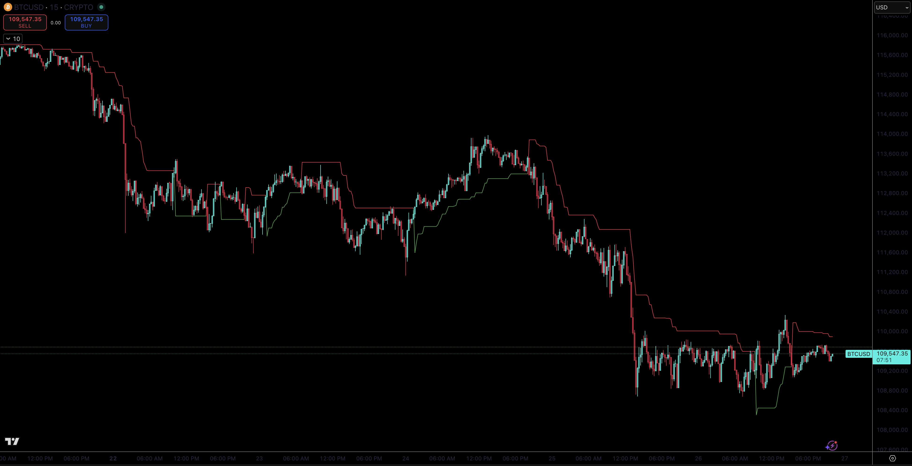

# Pine Collection
A collection of custom Pine Script v6 indicators. Each tool focuses on a clear use case with practical visuals and alerts across common market regimes (trend, range, momentum shifts, time-based filters).

### ADX & DI

ADX gauges trend strength while +DI/-DI suggests direction. ADX above the threshold signals a trend worth riding; below it, expect chop. Works well on liquid FX, indices, and major crypto—cleaner on 1h+ but usable intraday. DI crosses aid timing and the ADX slope adds conviction; avoid over-trading in ranges.

### Alligator, Fractals & S&R Combined

This stacks Bill Williams' Alligator with clean fractal markers and simple S/R lines. The Alligator provides trend context, fractal breaks offer entries, and S/R lines frame targets. Best on instruments that trend in bursts (indices, majors, trending alts). Great on 1h–4h; daily helps filter noise. Braided lines and whipsawing fractals indicate digestion.

### ATR Line

A simple ATR-based trailing stop that flips with price. Useful as a straightforward exit and for trailing winners in trending moves; it will chop in tight ranges. Good for futures, FX, and liquid crypto pairs. On lower timeframes, consider a smaller multiplier. If price hugs the line without follow-through, tighten risk or stand aside.

### Disparity Index

Measures how stretched price is from its moving average in percent terms. Extreme positive/negative reads are candidates for mean reversion in ranges; in strong trends, the index helps avoid chasing. Useful for equities and crypto where mean-reversion windows appear. Works on 15m–daily. If the index stays pinned, trend momentum is strong.

### EMA RSI Showdown v6

Blends momentum (MACD-style EMA spread), structure (EMA box), and an EMA’d RSI for signals. RSI extremes set bias, MACD flips confirm, and trades trigger only with price above/below the box. Good on intraday futures/crypto where momentum rotations are frequent. Avoid during major news or flat sessions. If two out of three conditions disagree, stand aside to avoid forced trades.

### Gradient Cables

A gradient ribbon of layered EMAs with the 200 SMA for structure, plus multi-timeframe checks. The ribbon visualizes trend health (compression/expansion and ordering), while H1 agreement filters M15 signals. Square/diamond markers flag aligned trends and major trend states. Well-suited to indices, FX, and liquid crypto. Clean on 15m–4h; in chop, expect alternating signals and reduce exposure.

### jbrz0 sniper

A "take the clean break" style tool: TEMA/DEMA momentum arrows plus a lightweight Supertrend flip, with optional channel and S/R context. Entry arrows are most reliable when the Supertrend agrees; EMA color helps avoid counter‑trend pokes. Shines on intraday indices and active crypto pairs. In choppy conditions, throttle size or stand down. Treat it as a trigger, not a full system—risk and context still matter.

### Moving Averages (v6)

Bread-and-butter trend map: EMA 20/50 for momentum, SMA 100/200 for structure. 20/50 crosses hint at shifts, and price relative to 100/200 expresses higher-timeframe bias. Great for everything liquid—equities, FX, crypto. Cleanest on 1h+; on lower TFs, expect more noise. Respect the slope: flat MAs usually mean the market owes nothing.

### Quick RSI

A fast, smoothed RSI variant that reacts without being twitchy. Useful for early momentum shifts, OB/OS tags, and divergence checks—good for scalps to swing. Works across assets; best on 5m–4h. Normalization helps compare symbols. If it whips around the zero line, expect range and de‑risk.

### Smooth SAR

A gentler take on Parabolic SAR to track swings without the usual jitter. Trails trends and marks flips for exhaustion or regime change. Best on trending symbols (indices, FX majors). On low‑TF chop, reduce AF or skip. Clustered flips signal indecision—trade lighter.

### Stochastic Ribbon

A layered look at rolling highs/lows—think multiple stochastic envelopes as a visual ribbon. Compression/expansion and ribbon flips help read momentum regimes and potential breakouts. Pairs well with price action on 15m–4h across assets. If all lines flatten, expect range. Read it like a heatmap: more alignment means higher conviction.

### Support & Resistance Lines

Draws recent swing levels and projects them forward. Simple, readable S/R for planning: buy pullbacks into support in uptrends, fade into resistance in ranges. Works on any liquid market; higher TFs receive more respect. Quick pivots help on intraday. If price keeps slicing through a level, treat it as noise.
